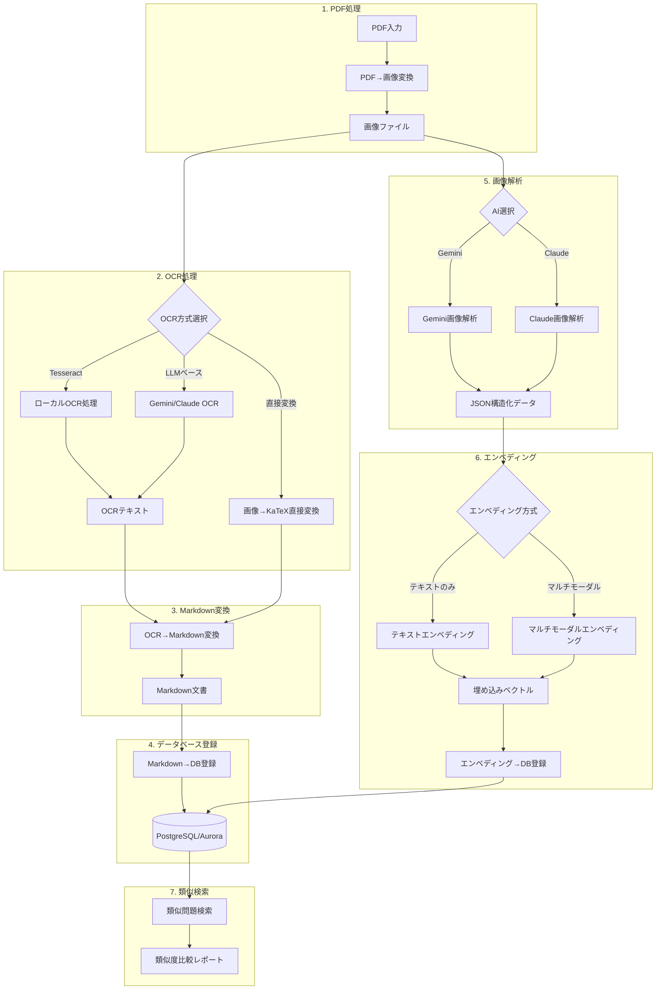

# OCR処理パイプラインフロー図



## 処理ステップ詳細

1. **PDF処理**
   - PDFファイルを入力として受け取り
   - Popplerを使用してページ単位に高品質画像に変換
   - 変換画像を一時保存

2. **OCR処理**
   - 3種類のOCR方式から選択可能:
     - Tesseract（ローカルOCR）
     - LLMベースOCR（Gemini/Claude）
     - 画像からKaTeXへの直接変換
   - OCRテキストファイルを生成

3. **Markdown変換**
   - OCRテキストをMarkdown形式に変換
   - 数式をKaTeX形式に変換
   - 図表を適切な画像タグに変換
   - レイアウトを整形

4. **データベース登録**
   - Markdownテキストをデータベースに登録
   - 問題ID、年度などのメタデータを付与

5. **画像解析**
   - GeminiまたはClaude APIを使用して画像を解析
   - 問題構造（問題文、選択肢、解説など）を自動認識
   - 回路図や表などの図形的要素も検出
   - JSON形式で構造化データを出力

6. **エンベディング生成**
   - 2種類のエンベディング方式:
     - テキストのみのエンベディング
     - マルチモーダルエンベディング（画像＋テキスト）
   - 埋め込みベクトルをデータベースに登録

7. **類似検索**
   - ベクトル類似度に基づく問題検索
   - 類似度比較レポートの生成

## パイプライン実行オプション

```bash
# 基本実行（Tesseract OCR使用）
./run_pipeline.sh data/pdf/document.pdf --year 2024

# LLMベースOCR使用（Gemini）
./run_pipeline.sh data/pdf/document.pdf --use-llm --gemini --year 2024

# 画像から直接KaTeX変換
./run_pipeline.sh data/pdf/document.pdf --direct-katex --year 2024

# マルチモーダルエンベディング使用
./run_pipeline.sh data/pdf/document.pdf --use-llm --gemini --multimodal-embedding
``` 